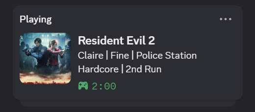
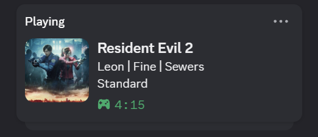
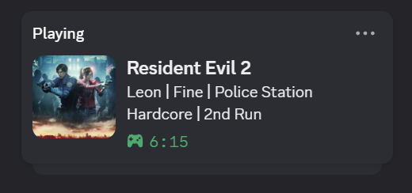

# Discord Rich Presence for Resident Evil 2 Remake

A simple REFramework mod that shows what you're doing in Resident Evil 2 Remake on your Discord profile!

  
  
  

## What it shows
- **Character:** Leon, Claire, and others
- **Scenario:** Show if it's your 2nd Run
- **Difficulty:** Assisted, Standard, Hardcore
- **HP Status:** Fine, Caution, Danger, Poison

Everything is fully customizable through `config.ini`, and you can translate text using `Discord_Presence_RE2R_Translation.ini`.

## How to install
1. Make sure you have [**REFramework**](https://www.nexusmods.com/residentevil22019/mods/1097) installed.
2. Download mods from releases.
3. Drop `DiscordPresenceRE2R.dll` into your `reframework/plugins/` folder.

## Building from source
If you want to compile mod yourself, just use `build.bat` script or use `CMakeLists.txt` for your favorite IDE.

## License
Check the [LICENSE](LICENSE) file.
